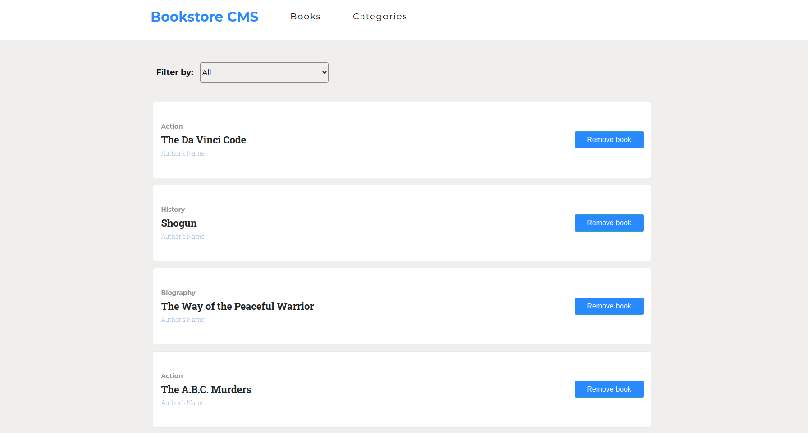

# My Magic Bookstore 

This project is about making a simple bookstore app using React-Redux.
It was created with [Create-React-App](https://github.com/facebook/create-react-app)

## Screenshot



## Live version

* https://my-magic-bookstore.herokuapp.com/

## Get started

```bash
   git clone git@github.com:Mesi21/My_magic_bookstore
   cd into the folder by typing: cd My_magic_bookstore
   Run npm install
   Run npm start
```

 :heavy_plus_sign: add your contribution if you'd like
 And please feel free to make a PR

## Technology

- Redux
- React-DOM
- React-Create-App
- npm
- Javascript ES6
- Nodejs
- HTML && CSS

## Contributor:

Molnar Emese:

  - [Github](https://github.com/Mesi21)  
  - [Email:](mailto:mse212002@gmail.com) - mse212002@gmail.com
  - [Portfolio]()
  - [LinkedIn](https://www.linkedin.com/in/emesemesimolnar/).  
  - [Twitter](https://twitter.com/buksimesi21) 
  - [Angel List]()
    
## Features
- Ability to add new books to the list
- Ability  to remove books from the list
- Ability to filter the list of the books by their category.

## Future Features
- User authentication feature.
- Store the data using back-end API 
- Add progress bar of completed reading percentage for each book.

## Show your support:

Give a :star: if you liked the app

## License

This project is [MIT](https://tldrlegal.com/license/mit-license) licensed.

### This README.md will be updated soon
